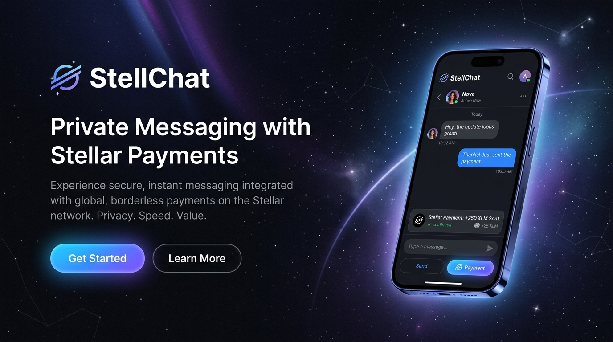
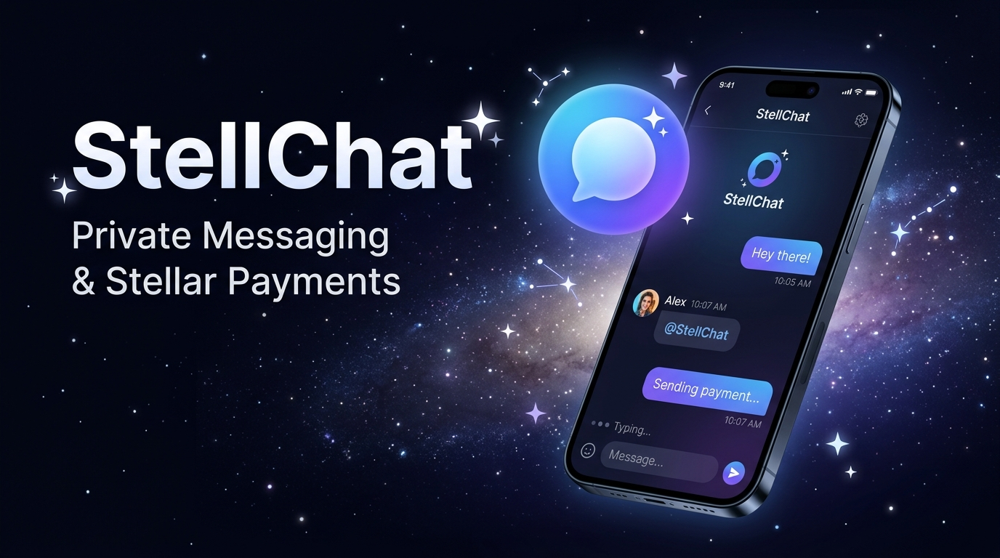
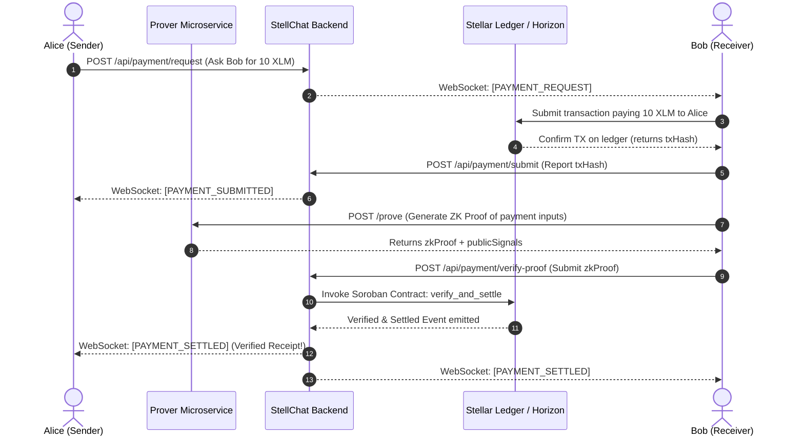

# StellChat



> **Private conversations with native, verifiable Stellar payments.**

StellChat is a privacy-first, end-to-end encrypted messaging application that integrates native Stellar payments directly within the conversation. Users can communicate securely and exchange value seamlessly using zero-knowledge (ZK) transaction receipts, keeping financial metadata private while ensuring ledger settlement.

---

## 🌌 Overview

StellChat makes payments a natural extension of conversation. In standard private messengers, exchanging funds requires pivoting to external apps, disclosing wallet addresses, and leaking payment records. StellChat keeps conversation data completely off-chain and encrypted, while utilizing the Stellar network and Soroban smart contracts to authenticate payments and settle transactions privately.

---

## 💡 Key Highlights & Features

- **Wallet-First Authentication:** Session tokens derived from signature challenges signed by private wallets (Freighter/embedded wallets).
- **ZK Soroban Verifier:** Cryptographically prove transactions using Poseidon hash commitments inside a Plonk Groth16 SnarkJS pipeline, verified on-chain by Soroban smart contracts.
- **Micro-Animations:** A beautiful 60fps native Flutter physics particle animation engine displaying glowing space backgrounds, loading sweeps, and payment checkmarks.
- **S3 Presigned Media Storage:** Ephemeral media attachments are uploaded directly to MinIO using pre-signed tokens for maximum client security and performance.
- **Distributed Tracing:** Logs are trace-bound with correlation IDs across mobile, backend, Redis, proving services, and Stellar ledger blocks.

---

## 🎨 Visual Identity

| Play Store Feature Graphic | OpenGraph Banner |
|---|---|
|  |  |

---

## 🛠️ Architecture

StellChat is organized as a monorepo featuring a stateless routing backend, a Dart client, Soroban smart contracts, and ZK circuits.



---

## 🚀 Tech Stack

- **Client:** Flutter, Riverpod, Hive, Sodium
- **Backend:** NestJS (TypeScript), TypeORM, PostgreSQL, Redis (real-time event pipeline)
- **Smart Contracts:** Soroban, Rust
- **Zero-Knowledge:** Circom, SnarkJS, Groth16 (bn128 curve)
- **Object Storage:** MinIO (S3 Compatible API)

---

## 📁 Repository Structure

```
stellchat/
├── apps/
│   ├── mobile/            # Flutter cross-platform mobile client
│   ├── backend/           # NestJS message router and event mediator
│   └── prover/            # Node.js SnarkJS ZK proving microservice
├── contracts/
│   └── stellar/           # Soroban smart contracts for settlement & verification
├── zk/
│   └── circuits/          # Circom ZK circuit definitions
├── docs/                  # System documentation & brand guidelines
├── submission/            # Judges Hackathon Submission Package
├── Makefile               # Local laboratory make targets
└── README.md              # Project portal
```

---

## ⚙️ Local Development & Quickstart

Deploy the complete local laboratory (Stellar Horizon Node, Friendbot funding network, Soroban RPC, PostgreSQL database, Redis caches, MinIO storage, SnarkJS provers, and the NestJS WebSocket gateway) using our Makefile:

### 1. Boot Laboratory
```bash
# Wipes database volumes, builds containers, compiles circuits, and deploys contracts
make reset-demo
```

### 2. Verify Health
```bash
# Query status endpoints of all running docker services
make check-health
```

### 3. Run E2E Integration Tests
```bash
# Validates socket routing, authentication challenges, and verifier event bindings
make test
```

### 4. Launch Client App
```bash
cd apps/mobile
flutter pub get
flutter run
```

---

## 📚 References & Guides
- **Live Demo Script:** [submission/demo-script.md](file:///home/sugarcube/Desktop/Documents/Code-Server/Hackathon%20Projects/Stellar-DH/StellChat/submission/demo-script.md)
- **Judges' Guide:** [submission/judges-guide.md](file:///home/sugarcube/Desktop/Documents/Code-Server/Hackathon%20Projects/Stellar-DH/StellChat/submission/judges-guide.md)
- **Brand Guidelines:** [docs/brand/brand-guidelines.md](file:///home/sugarcube/Desktop/Documents/Code-Server/Hackathon%20Projects/Stellar-DH/StellChat/docs/brand/brand-guidelines.md)
- **Demo Runbook:** [docs/demo-runbook.md](file:///home/sugarcube/Desktop/Documents/Code-Server/Hackathon%20Projects/Stellar-DH/StellChat/docs/demo-runbook.md)

---

## 📝 License

This project is licensed under the MIT License - see the [LICENSE](file:///home/sugarcube/Desktop/Documents/Code-Server/Hackathon%20Projects/Stellar-DH/StellChat/LICENSE) file for details.
