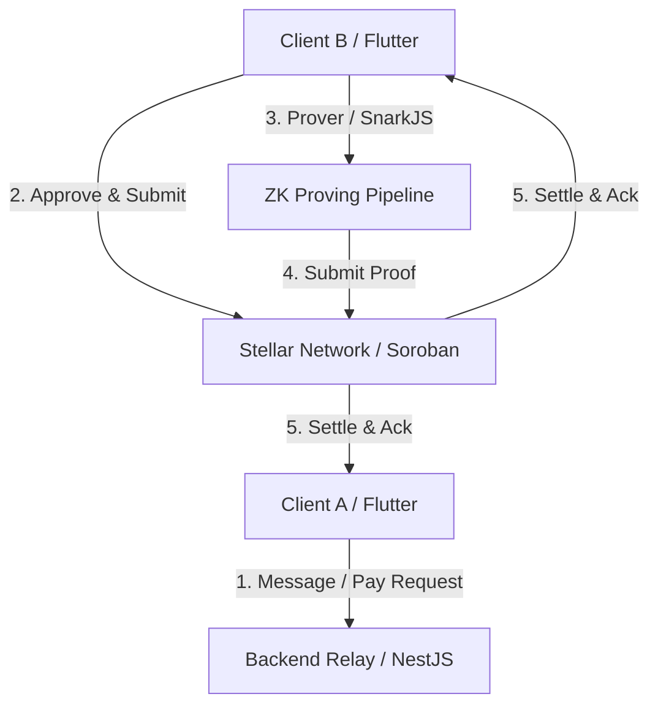

# StellChat

> Private conversations with native, verifiable Stellar payments.

StellChat is a privacy-first, end-to-end encrypted messaging application that integrates native Stellar payments directly within the conversation. Users can communicate securely and exchange value seamlessly using zero-knowledge (ZK) transaction receipts, keeping financial metadata private while ensuring ledger settlement.

---

## Overview

StellChat makes payments a natural extension of conversation. In standard private messengers, exchanging funds requires pivoting to external apps, disclosing wallet addresses, and leaking payment records. StellChat keeps conversation data completely off-chain and encrypted, while utilizing the Stellar network and Soroban smart contracts to authenticate payments and settle transactions privately.

---

## Problem & Solution

### The Problem
Traditional communication platforms and wallets suffer from a fragmentation of privacy:
- **Centralized Messengers:** Leak communication metadata and require identity bindings (phone numbers/emails).
- **Public Blockchains:** Expose financial addresses, balances, and history to anyone who inspects the transaction ledger, creating linkability between physical users and their wealth.

### The Solution
StellChat resolves this through a hybrid architecture:
1. **End-to-End Cryptography:** Direct communication uses Libsodium's curve25519 authenticated encryption. Senders and recipients are recognized solely by cryptographic public keys.
2. **Native Stellar Payments:** Assets like USDC and XLM are transferred instantly inside the chat window.
3. **Zero-Knowledge Receipts:** Provers on the device generate cryptographic ZK-SNARK proofs of payment, verified on-chain by Soroban contracts to confirm ledger settlement without exposing the transaction details to the relay network.

---

## Architecture

StellChat is organized as a monorepo featuring a stateless routing backend, a Dart client, Soroban smart contracts, and ZK circuits.



---

## Tech Stack

- **Client:** Flutter, Riverpod, Hive, Sodium
- **Backend:** NestJS (TypeScript), TypeORM, PostgreSQL, Redis (real-time event pipeline)
- **Smart Contracts:** Soroban, Rust
- **Zero-Knowledge:** Circom, SnarkJS, Groth16 (bn128 curve)

---

## Stellar Integration

Only trust-sensitive operations are logged on-chain. Message persistence remains off-chain.
- **Soroban Contracts:** Manage transaction authorizations and verifier status constraints.
- **Stellar Assets:** Integrated support for XLM and USDC stablecoin.
- **Horizon API:** Direct connection to Stellar testnet ledgers.

---

## Zero-Knowledge Verification

To maintain user transaction privacy:
- The sender hashes transaction parameters using a **Poseidon Hash Function** to produce a commitment.
- The payer calculates ZK Groth16 proofs proving the validity of the commitment without revealing the private parameters.
- The recipient/contract validates the proof payload to finalize payment visibility in-chat.

---

## Repository Structure

```
stellchat/
├── apps/
│   ├── mobile/            # Flutter cross-platform mobile client
│   └── backend/           # NestJS message router and event mediator
├── contracts/
│   └── stellar/           # Soroban smart contracts for settlement & verification
├── zk/
│   ├── circuits/          # Circom ZK circuit definitions
│   ├── proofs/            # Generated Groth16 / SnarkJS proofs
│   └── verifier/          # Go verifier binary
├── packages/
│   ├── shared/            # Shared cryptographic helpers
│   ├── sdk/               # StellChat developer SDK
│   └── types/             # Common data model interfaces
├── docs/                  # System documentation
└── README.md              # Project portal
```

---

## Demo Flow

The entire user flow completes comfortably within a 3-minute hackathon demo:
1. **Connect Wallet:** Payer binds their Stellar wallet account (Freighter/Albedo simulator) and displays balances.
2. **Send Message:** Establish an E2EE channel and exchange messages.
3. **Request Payment:** Request USDC/XLM in-chat, spawning a `PENDING` card.
4. **Approve Payment:** Payer clicks *Approve & Pay*, broadcasting a transaction to Stellar and generating a ZK proof.
5. **Verify Proof:** The contract verifies the proof, updating the card to `ZK VERIFIED` with a direct Stellar Explorer link.

---

## Local Development

### Run Backend Services
```bash
# Start PostgreSQL & Redis
docker-compose up -d

# Install backend dependencies
cd apps/backend
npm install
npm run start:dev
```

### Run Mobile App
```bash
cd apps/mobile
flutter pub get
flutter run
```

---

## Deployment

Deploy the NestJS backend via Docker or Render:
```bash
docker build -t stellchat/backend:latest -f apps/backend/Dockerfile .
```
See [docs/deployment.md](file:///home/sugarcube/Desktop/Documents/Code-Server/Hackathon%20Projects/Stellar-DH/StellChat/docs/deployment.md) for details.

---

## Future Work

- [ ] Message reactions in timeline
- [ ] Improved multi-media attachment compression
- [ ] Direct merchant transaction invoice cards
- [ ] Soroban mainnet deployments

---

## License

This project is licensed under the MIT License - see the [LICENSE](file:///home/sugarcube/Desktop/Documents/Code-Server/Hackathon%20Projects/Stellar-DH/StellChat/LICENSE) file for details.
