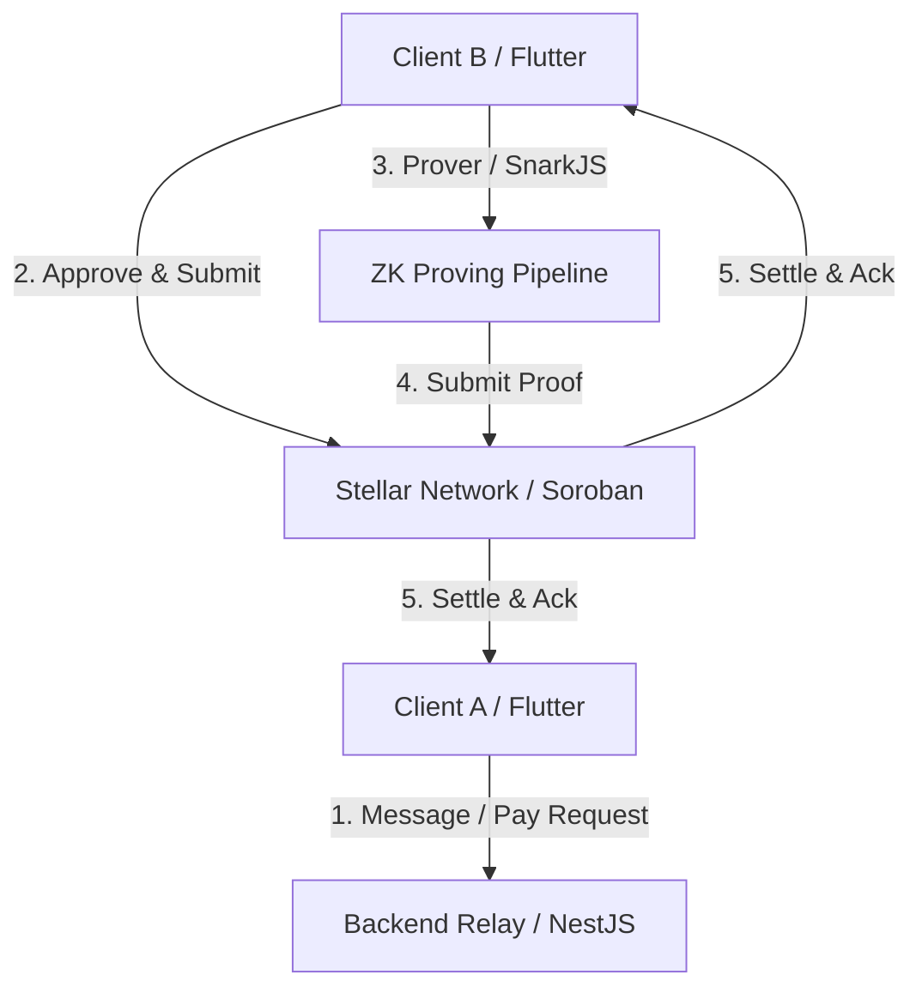

# StellChat System Architecture

StellChat is a privacy-first decentralized messaging application with native, verifiable Stellar payment capabilities. This document outlines the system architecture, component layout, and workflow of the platform.



## Core Design Principles

1. **Privacy-First Communications:** All messaging is encrypted end-to-end (E2EE) using Libsodium. Server relays routing the traffic do not have access to private keys or plaintext communication content.
2. **Native Payment Integration:** Payments are treated as first-class citizen events within chat conversations. Users can request and send Stellar assets (XLM, USDC) without leaving the chat interface.
3. **Zero-Knowledge Payment Receipts:** To verify that a transaction actually occurred on the public ledger without exposing the specific transaction amounts, sender/receiver keys, and context, ZK proofs are generated by the payer and verified by the payee/smart contract.
4. **Decentralized Trust Operations:** High-security transactions and ZK verification are acknowledged on-chain via Stellar Soroban contracts, while chat message histories and relays remain completely off-chain.

---

## Folder Structure Layout

```
stellchat/
├── apps/
│   ├── mobile/            # Flutter cross-platform mobile client
│   └── backend/           # NestJS message router and event mediator
├── contracts/
│   └── stellar/           # Soroban smart contracts for settlement & verification
├── zk/
│   ├── circuits/          # Circom ZK circuit definitions
│   ├── proofs/            # Generated Groth16 / SnarkJS proofs
│   └── verifier/          # Go verifier binary
├── packages/
│   ├── shared/            # Shared cryptographic helpers
│   ├── sdk/               # StellChat developer SDK
│   └── types/             # Common data model interfaces
├── docs/                  # System documentation
└── README.md              # Project portal
```

---

## Component Roles & Responsibilities

### 1. Client App (`apps/mobile`)
- Manages user identity generation (24-word seed phrase) and secure local key storage.
- Encrypts/decrypts direct messaging payloads and files using `sodium`.
- Manages the local SQLite / Hive database.
- Orchestrates Stellar wallet integration (Freighter / Albedo / Keypair).
- Spawns local provers to generate ZK proofs using Poseidon hashes.

### 2. Backend Relay (`apps/backend`)
- Implements NestJS API endpoints for registering users and relay configurations.
- Coordinates Redis pub/sub messaging channels for real-time delivery and push notifications.
- Facilitates payment requests and provides proof-generation schemas.
- Exposes verifying endpoints that execute proof validations.

### 3. Smart Contracts (`contracts/stellar`)
- Soroban smart contracts deployable to the Stellar Testnet.
- Logs payment authorizations and enforces proof verification constraints on-chain.
- Emits settlement events to trigger client UI updates.

### 4. ZK Proving Pipeline (`zk/`)
- Contains the `payment_hasher.circom` circuit compiled to R1CS.
- Validates that a private payment hash corresponds to a public ledger transaction commitment.
