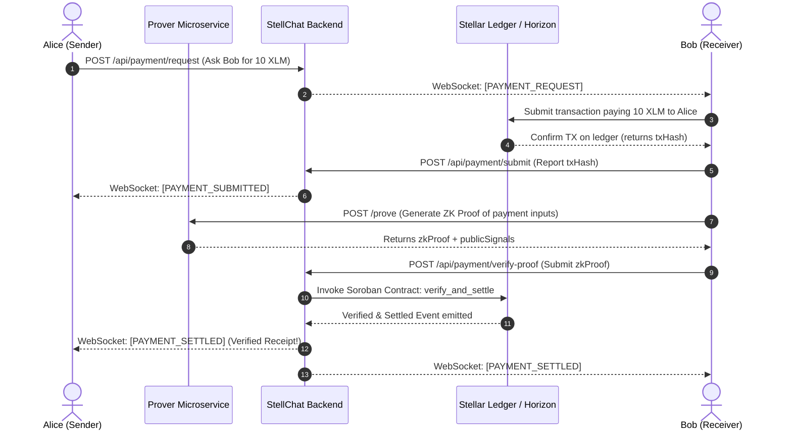

# StellChat — System Architecture

The following diagram outlines the messaging, payment, and zero-knowledge proof verification pipeline.

```mermaid
sequenceDiagram
    autonumber
    actor Alice as Alice (Sender)
    participant Prover as Prover Microservice
    participant Relay as StellChat Backend
    participant Horizon as Stellar Ledger / Horizon
    actor Bob as Bob (Receiver)

    Alice->>Relay: POST /api/payment/request (Ask Bob for 10 XLM)
    Relay-->>Bob: WebSocket: [PAYMENT_REQUEST]
    Bob->>Horizon: Submit transaction paying 10 XLM to Alice
    Horizon-->>Bob: Confirm TX on ledger (returns txHash)
    Bob->>Relay: POST /api/payment/submit (Report txHash)
    Relay-->>Alice: WebSocket: [PAYMENT_SUBMITTED]
    
    Bob->>Prover: POST /prove (Generate ZK Proof of payment inputs)
    Prover-->>Bob: Returns zkProof + publicSignals
    
    Bob->>Relay: POST /api/payment/verify-proof (Submit zkProof)
    Relay->>Horizon: Invoke Soroban Contract: verify_and_settle
    Horizon-->>Relay: Verified & Settled Event emitted
    Relay-->>Alice: WebSocket: [PAYMENT_SETTLED] (Verified Receipt!)
    Relay-->>Bob: WebSocket: [PAYMENT_SETTLED]
```
